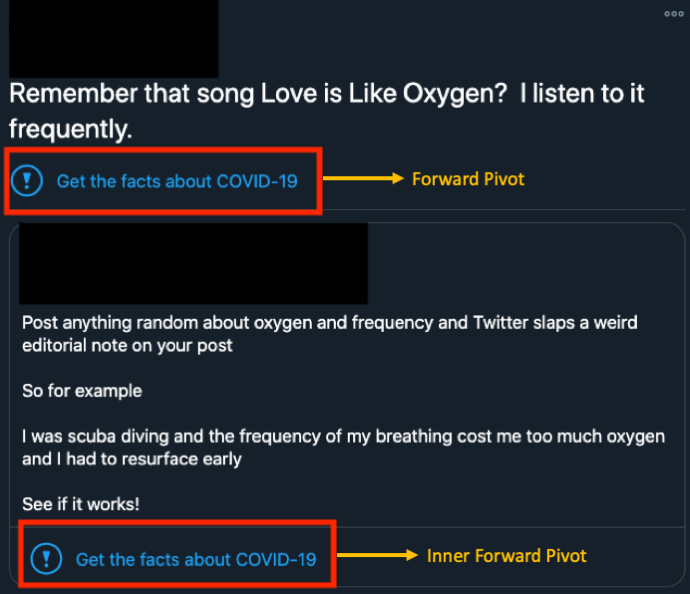

# Soft Moderation Interventions on Twitter
The repository contains a dataset of tweets that received soft moderation interventions (i.e., warning labels) from Twitter. We make publicly available the tweet ids and the attached warning labels. For more information about the data collection see this [paper](https://arxiv.org/abs/2101.07183).

# Data Organization

The dataset consists of the tweet ids and the associated warning labels. There are two fields for the warning labels (see image below for an example): 

- **ForwardPivotInt**: This field is set when the tweet had a warning label attached to it.
- **InnerForwardPivotInt**: This field is set when the tweet quotes another tweet that had a warning label attached to it.

# Hydrating tweets

To hydrate the JSON data for each tweet ID see the [Twitter Docs](https://developer.twitter.com/en/docs/twitter-api/tweets/lookup/api-reference) or the [Hydrator repository](https://github.com/DocNow/hydrator). 

## Reference
If you use this dataset please cite the following paper:

    @inproceedings{zannettou2021won,
    author={Zannettou, Savvas},
    title={"I Won the Election!": An Empirical Analysis of Soft Moderation Interventions on Twitter},
    booktitle={Proceedings of the International AAAI Conference on Web and Social Media},
    year={2021}
    }

